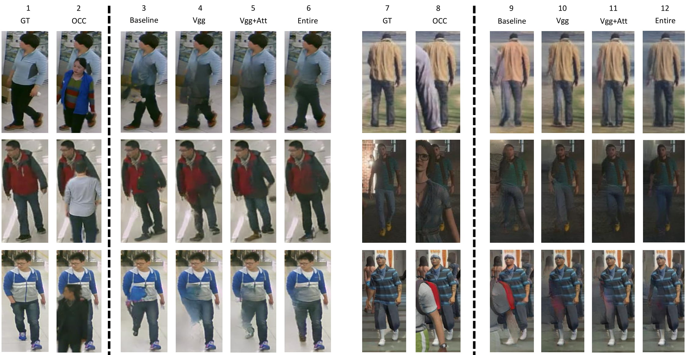

# Can Adversarial Networks Hallucinate Occluded People With a Plausible Aspect?

<p align="center">

</p>

When you see a person in a crowd, occluded by other persons, you miss visual information that can be used to recognize, re-identify or simply classify him or her. You can imagine its appearance given your experience, nothing more. Similarly AI solutions can try to hallucinate missing information with specific deep learning architectures, suitably trained with people with and without occlusions. The goal of this work is to generate a complete image of a person, given an occluded version in input, that should be a) without occlusion b) similar at pixel level to a completely visible people shape c) capable to conserve similar visual attributes (e.g. male/female) of the original one.

[Federico Fulgeri](https://github.com/fedeful),[Matteo Fabbri](http://aimagelab.ing.unimore.it/imagelab/person.asp?idpersona=99),[Stefano Alletto](http://aimagelab.ing.unimore.it/imagelab/person.asp?idpersona=83),[Simone Calderara](http://aimagelab.ing.unimore.it/imagelab/person.asp?idpersona=38) ,[Rita Cucchiara](http://aimagelab.ing.unimore.it/imagelab/person.asp?idpersona=1)

# Setup

### Prerequisites
- NVIDIA GPU + CUDA CuDNN (CPU mode may work with minimal changing)
- pytorch >= 0.4.0
- torchvision >= 0.1.8
- tensorboardX >= 1.2
- tensorboard >= 1.12.0
- OpenCV >= 3.4.1


### Available Models

| Pre-Trained Models | Pretrained Model |
|:-------:|:----------------:|
| RAP |[Download](https://drive.google.com/file/d/18qadAZyrb-YqyN5d-K7lVXPVP2ZbTSsY/view)|
| AIC |[Download](https://drive.google.com/file/d/1SZ65AqEDJCNKdZyvUMwpkW2h6QyFRVQi/view)|
Use the pre-trained models with the following option:
- baseline   &rarr;option:  --gen_type unet
- vgg        &rarr;option:  --gen_type unet
- vgg-att    &rarr;option:  --gen_type unet
- entire     &rarr;option:  --attribunet

### Classifier

| Model | Dataset | Pretrained Model |
|:-----:|:-------:|:----------------:|
|  ResNet-101  | RAP |[Download](https://drive.google.com/file/d/1eR8eiYNTDgZuloSsMaYEe73j3JcdHy2k/view)|
|  ResNet-101  | AIC |[Download](https://drive.google.com/file/d/1X2amq15os39t79zZLJAQ9p-fLorUxu6s/view)|


### Datasets

| Dataset |  Link |
|:-----:|:-------:|
| RAP |[Download](https://drive.google.com/file/d/1CRbnzxxnkWyYWSrHvQAesE8bOvMaRL74/view)|
| AiC |[Download](http://imagelab.ing.unimore.it/aic)|

# Path Setup

1) Download the datasets and all the pre-trained weights

2) Move the two classifiers weights as follow :

- AIC classifier aicC.zip --> ../NAIC/lastmar.checkpoint

- RAP classifier rapC.zip --> ../RAP/lastmar.checkpoint

**note**: <...> is used as placeholder

Datasets folder organization must be as follow:
```javascript
/datasets
|
---- /NAIC
|    |
|    ---- /crops
|    |    <name_1>_occ.jpg
|    |    <name_1>.jpg
|    |    ...
|    |
|    annotations.json
|    lastmar.checkpoint
|    
---- /RAP
|    |
|    ---- /RAP_dataset
|    |    <name_1>.png
|    |    <name_2>.png
|    |    ...
|    |
|    ---- /RAP_occluded
|    |    <name_1>.png
|    |    <name_2>.png
|    |    ...
|    |
|    ---- /RAP_annotation
|    |    RAP_annotation.mat
|    |    rap_evaluation.m
|    |    ReadMe.txt
|    |    ...
|    |
|    lastmar.checkpoint
|    broken_test.json
|    broken_train.json
```

3) Change path_config.py according folders organization: datasets, project and log (DS, PJ, LG)

```python
import os
import socket

from .folder_utils import check_generate_dir

PYTHONPATH = '..:.'
if os.environ.get('PYTHONPATH', default=None) is None:
    os.environ['PYTHONPATH'] = PYTHONPATH
else:
    os.environ['PYTHONPATH'] += (':' + PYTHONPATH)


class PathMng(object):
    HOSTNAME = socket.gethostname()
    h_name = 'CURRENT HOSTNAME: {} '.format(HOSTNAME)
    print(h_name)

    if HOSTNAME == '<PC HOSTNAME NAME>':
        DS_PATH = '<datasets path>/datasets'
        PJ_PATH = '<project path>/deocclusion'
        LG_PATH = '<experiments and log path>/results'
    elif ...
```
4) If you use pre-trained networks put the downloaded folders inside LG_PATH.
Each folder correspond to one experiment and it has to contain a file named
last.checkpoint

# Usage Options

## Train classifier
```
usage: main_classification.py

  --exp_name                     experiment name
  --img_size                     default (320,128)
  --gpu                          gpu usage
  --gpu_id                       gpu id number
  --fold                         RAP offers 4 different folds: default value is 0
  --dataset                      dataset to use: AIC | RAP
  --epochs                       number of training epochs
  --batch_size                   training batch size
  --lr                           learning rate default 0.0002
  --attributes                   (int) number of attributes: 51 RAP | 24 AIC
  --workers                      number of parallel workers
```

## Train deocclusion network
```
usage: main_deocclusion.py

  --exp_name                     experiment name
  --img_size                     default (320,128)
  --gpu                          gpu usage
  --gpu_id                       gpu id number
  --dataset                      dataset to use: AIC | RAP
  --c_in                         network input channel size 3
  --c_out                        network output channel size 3
  --epochs                       number of training epochs
  --batch_size                   training batch size, default 20
  --lr                           learning rate default 0.0002
  --w_init                       network weights initialization
  --attributes                   (int) number of attributes: 51 RAP | 24 AIC
  --workers                      number of parallel workers
  --gen_type                     kind of generator: classic | unet | attribunet
  --network_mode                 option for classic generator: upsamplig | transposed_conv
  --f                            64 channel increment factor
  --w1                           content loss weight: vgg | mse
  --w2                           attribute loss weight
  --second_loss                  content loss selection
  --third_loss                   only one loss available
  --fake_real_trick              one side smooth labeling
  --tc                           test frequency


```

## Test deocclusion network
```
usage: main_eval.py

  --exp_name                     experiment name
  --img_size                     default (320,128)
  --gpu                          gpu usage
  --gpu_id                       gpu id number
  --dataset                      dataset to use: AIC | RAP
  --c_in                         network input channel size 3
  --c_out                        network output channel size 3
  --batch_size                   (int) batch size use a value greater than 1, default 20
  --attributes                   (int) number of attributes: 51 RAP | 24 AIC
  --gen_type                     kind of generator: classic | unet | attribunet
  --network_mode                 classic generator mode: (default)upsamplig | transposed_conv
  --f                            64 channel increment factor
```

### Test file output

main_eval.py return 3 json file with metrics information:

- noise.json -> SSIM and PSNR

- class_mtr.json -> ACCURACY, PRECISION, RECALL, F1

- all_att_mtr.json -> MEAN ACCURACY : use only data['all_metrics']['mean_accuracy'],
the result should be an array with [gt_value, occluded_value, deoccluded_value]

## Convert image given a trained model
```
usage: main_img_producer.py
  --exp_name                     experiment name
  --img_size                     default (320,128)
  --gpu                          gpu usage
  --gpu_id                       gpu id number
  --dataset                      dataset to use: AIC | RAP
  --c_in                         network input channel size 3
  --c_out                        network output channel size 3
  --batch_size                   (int) batch size use a value greater than 1, default 20
  --attributes                   (int) number of attributes: 51 RAP | 24 AIC
  --workers                      number of parallel workers
  --gen_type                     kind of generator: classic | unet | attribunet
  --network_mode                 classic generator mode: upsamplig | transposed_conv
  --f                            64 channel increment factor
```

### Only if you change AiC classifier
The new classifier checkpoint must be inserted into the dataset folder (RAP/NAIC).
After that replace th.json inside the /deocclusion/config folder.
New th.json can be generated using main_threshold_aic.py

## Attributes loss info
Attributes loss formulation slightly change beween the two dataset, as you can see in /netloss/bce_loss.py.<br />
If you train deocclusion network we suggest to use --w2  option in this way:
- between 1 and 10 for RAP dataset
- between 0.01 and 0.1 for AiC dataset

The RAP loss formulation  did not bring equally good result on AiC dataset,
this change was made to get better results on generated images.


## Citation(https://arxiv.org/pdf/1901.08097.pdf)
If you use this code or AiC dataset for your research, please cite our paper <a href="https://arxiv.org/pdf/1611.07004v1.pdf">Can Adversarial Networks Hallucinate Occluded People With a Plausible Aspect?</a>:

```
@inproceedings{fabbri2019can,
  title     = {Can Adversarial Networks Hallucinate Occluded People With a Plausible Aspect?},
  author    = {Fulgeri, Federico and Fabbri, Matteo and Alletto, Stefano and Calderara, Simone and Cucchiara, Rita},
  booktitle = {arxiv},
  year      = {2019}
}
```

## Acknowledgments
Unet structure borrow from [Pytorch-UNet](https://github.com/milesial/Pytorch-UNet).
